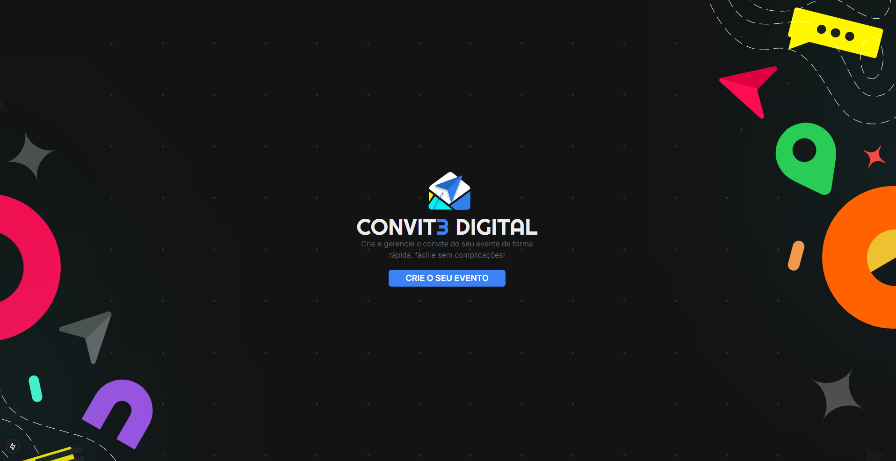
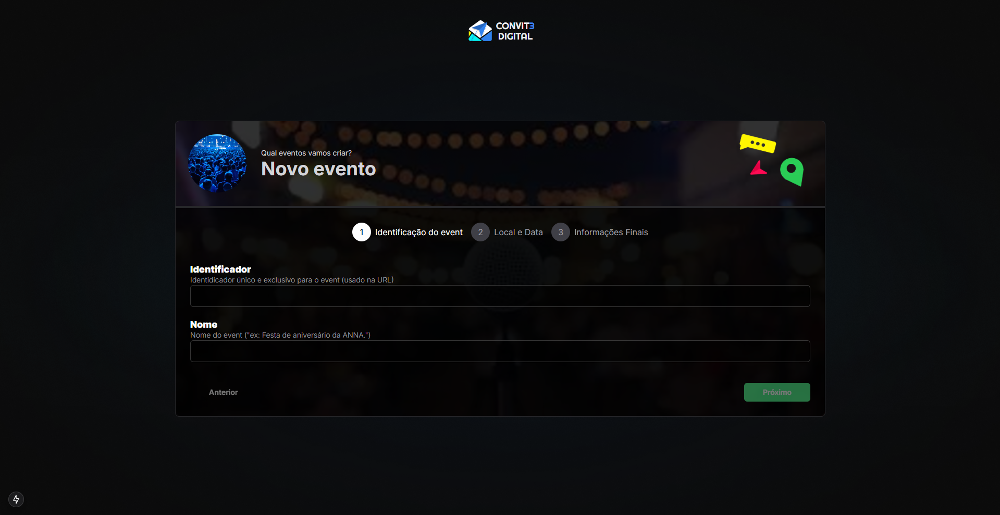
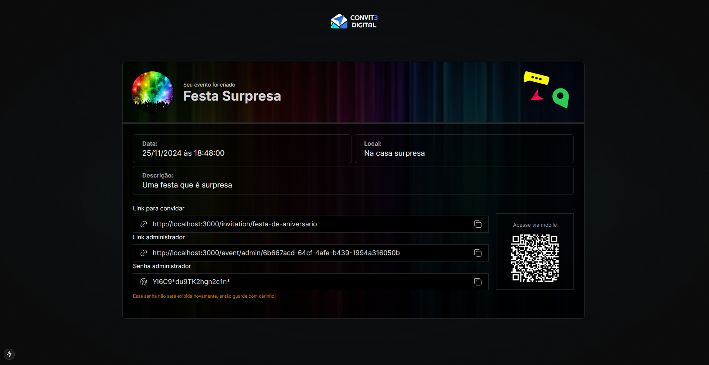
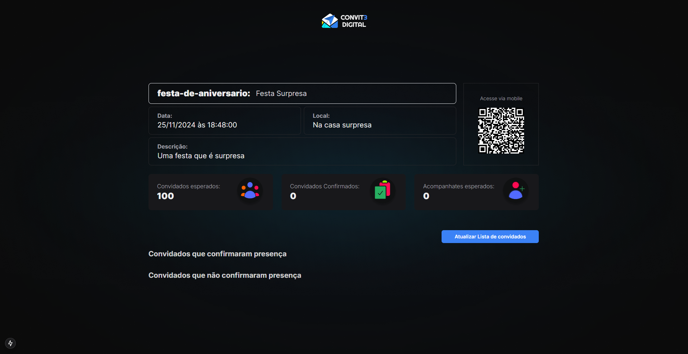
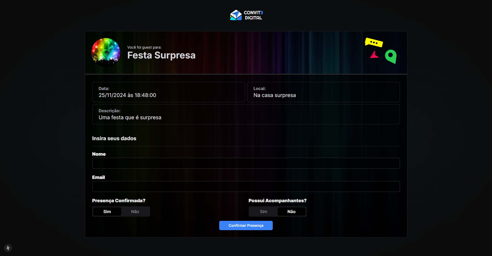
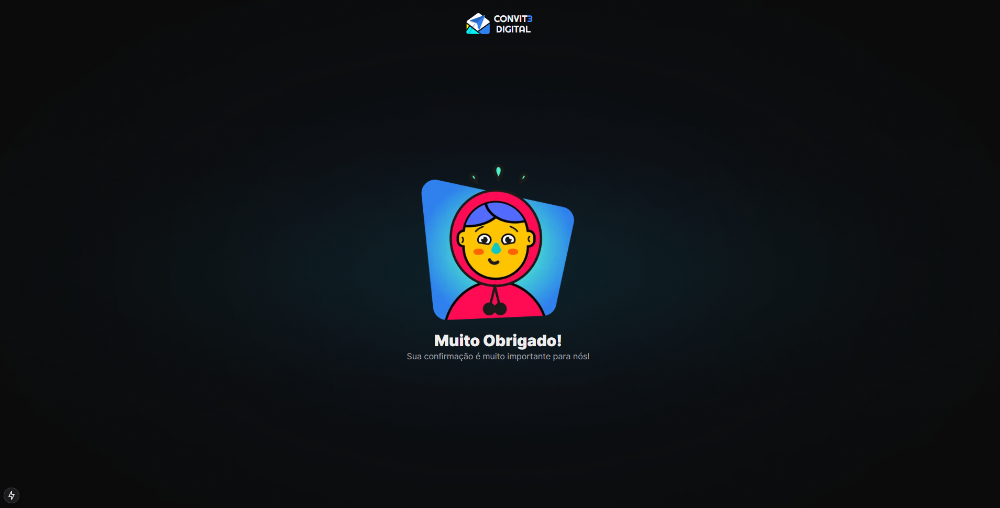

# **DigitalInvitation - Frontend**  

O **DigitalInvitation Frontend** foi desenvolvido utilizando tecnologias modernas para criar uma experiência responsiva e funcional, garantindo uma navegação fluida tanto em desktops quanto em dispositivos móveis.  

## **Tecnologias Utilizadas**  
- **Linguagem**: TypeScript.  
- **Framework**: React com Next.js.  
- **Estilização**: TailwindCSS.  

---

## **Estrutura de Rotas**  
O frontend utiliza o poder do Next.js para implementar rotas dinâmicas e estáticas:  
- **Rota Home**: Página inicial do site, apresentando informações gerais.  
- **Rota de Eventos**:  
  - Inclui a **rota de admin** para gerenciar eventos.  
  - Apresenta a **página de sucesso** ao criar um evento.  
- **Rota de Convite**:  
  - Implementada com **navegação dinâmica por alias**, facilitando acesso personalizado.  
  - Inclui uma página de **agradecimento** para quando o usuário se cadastrar.  

---

## **Responsividade**  
O site foi projetado para ser totalmente responsivo, oferecendo uma experiência adaptada a dispositivos móveis e mantendo a consistência visual em telas de diferentes tamanhos.  

---

### Imagens do Projeto:  

| Tela inicial                                    | Tela de cadastro                               |
|-------------------------------------------------|------------------------------------------------|
|  |  |

| Tela Evento                                     | Tela admin                                     |
|-------------------------------------------------|------------------------------------------------|
|  |  |

| Tela Convidados                                 | Tela Agradecimento                             |
|-------------------------------------------------|------------------------------------------------|
|  |  |
