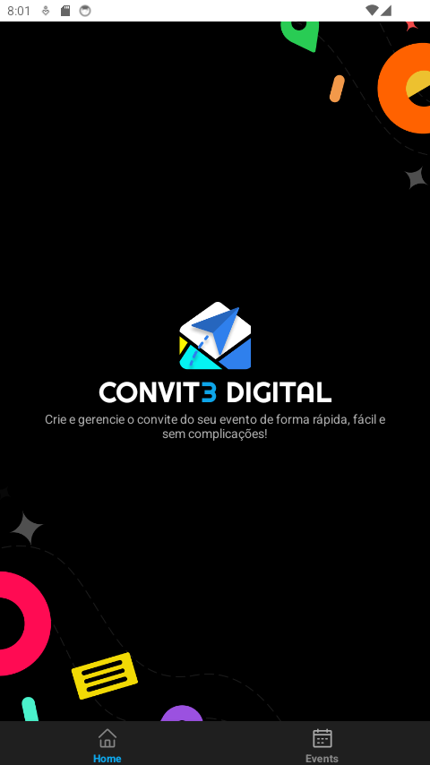

# **DigitalInvitation - Mobile**  

O **DigitalInvitation Mobile** é uma aplicação desenvolvida com **React Native** e **Expo Go**, proporcionando uma experiência fluida e moderna para gerenciamento e visualização de eventos diretamente do celular.  

## **Tecnologias Utilizadas**  
- **Framework**: React Native com Expo Go.  
- **Navegação**: Expo Router utilizando Stack e Tab Navigation.  
- **Estilização**: StyleSheet do React Native.  

---

## **Estrutura de Navegação**  
A aplicação conta com duas rotas principais organizadas em abas (Tabs):  
1. **Home**: Tela inicial que apresenta informações gerais.  
2. **Eventos**: Tela que lista os eventos cadastrados.  

A navegação entre as telas é feita de forma intuitiva, utilizando **Tab Navigation** para alternar entre as rotas e **Stack Navigation** para detalhamentos quando necessário.  

---

## **Estilização**  
A estilização é feita com **StyleSheet** do React Native, garantindo uma interface simples e funcional, adaptada para diferentes tamanhos de telas.  

---

## **Telas**  

| Tela Home                                      | Tela Eventos                                   |
|------------------------------------------------|-----------------------------------------------|
|  |  |

---
